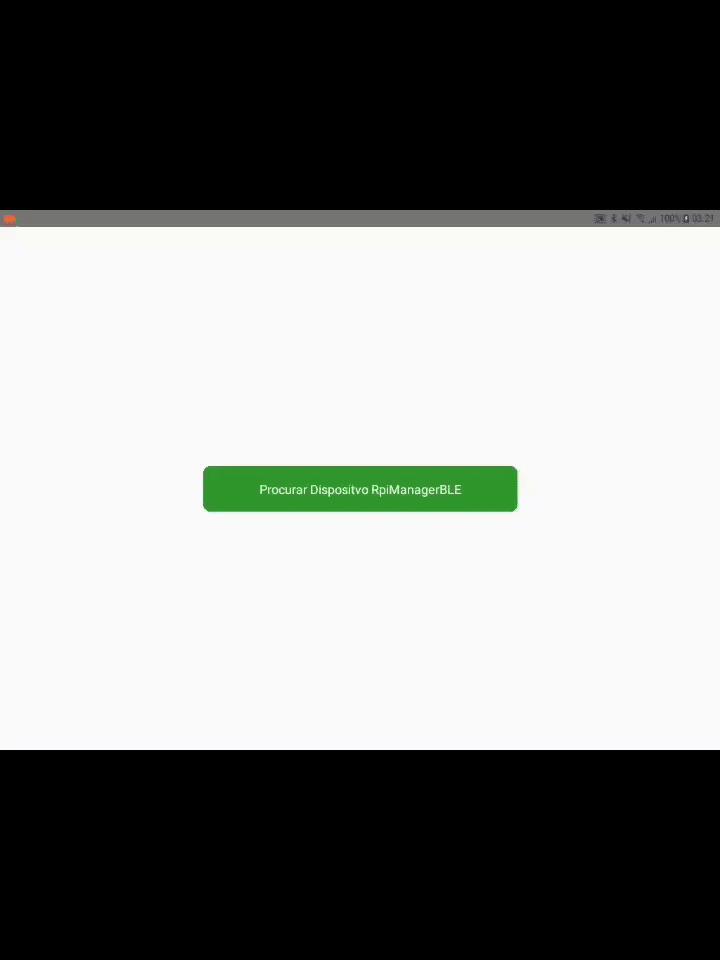

# RpiManagerBLE

O RpiManagerBLE é um projeto desenvolvido para gerenciar dispositivos Raspberry Pi utilizando Bluetooth Low Energy (BLE). O projeto contém componentes tanto de servidor quanto de cliente para interagir com o Raspberry Pi via BLE.

## Demo

## Estrutura do Projeto

- `RpiManagerBLE_Server`: Aplicação do lado servidor para gerenciar a comunicação BLE.
- `RpiManagerBLE_Client`: Aplicação do lado cliente para gerenciar e interagir com o Raspberry Pi.

## Requisitos

Antes de rodar o projeto, certifique-se de ter os seguintes itens instalados:

- Node.js (para servidor/cliente)
- Dispositivo compatível com BLE (para Raspberry Pi)
- [Outros softwares ou dependências]

## Licença

Este projeto está licenciado sob a Licença MIT - veja o arquivo [LICENSE](LICENSE) para mais detalhes.
